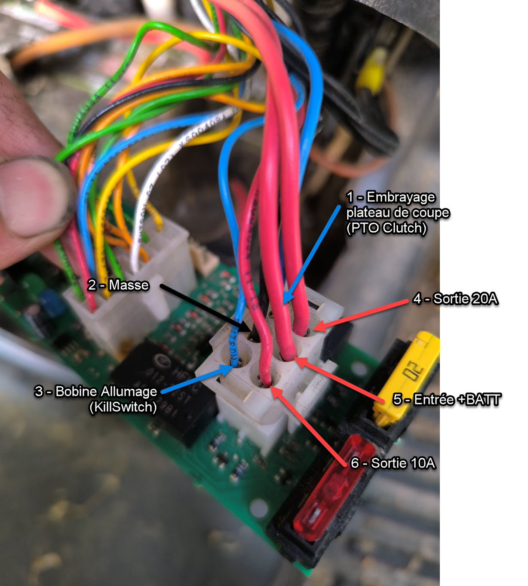
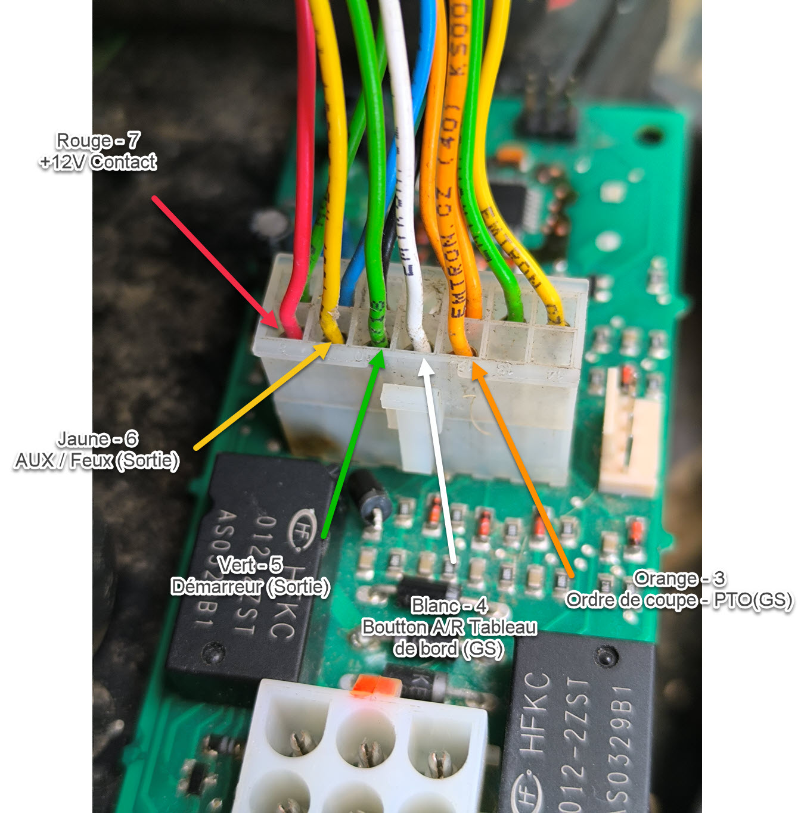
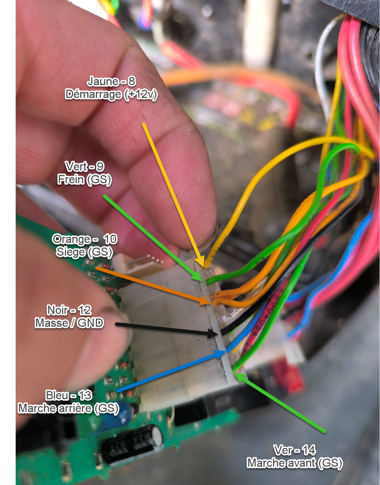

# Câblage — Power plug et Command Plug

Rétro-ingénierie du câblage d'alimentation de l'ECU MowerBoard sur le Staub 107 L 16 KH.

## Power socket (prise d'alimentation)

- Prise d'alimentation :

  

  

| Broche | Fonction | Couleur du fil | Tension | Notes |
|---|---|---|---|---|
| 1 | Embrayage plateau de coupe | Bleu | GND pour activer | Bobine 2 relais K1 |
| 2 | Masse | Noir | GND | |
| 3 | Kill Switch moteur | Bleu | GND = moteur OFF | Bobine 1 relais K1 - NC sur GND (sécurité) |
| 4 | Sortie carte (fusible 20A) | Rouge | +12V | |
| 5 | Entrée batterie | Rouge | +12V | |
| 6 | Sortie carte (fusible 10A) | Rouge | +12V | |

  

## Connecteur 2x7 pin Molex (14 broches)

- Prise de commandes :

  
  

Numérotation :
- Rangée A : broches 1→7
- Rangée B : broches 8→14

| Broche | Signal / Fonction | Direction | Couleur | Tension | Notes |
|---:|---|---|---|---|---|
| 1 | Non connecté | NC | | | |
| 2 | Non connecté  | NC | | | |
| 3 | Ordre de coupe / PTO | INPUT | Orange | Commutation de masse | |
| 4 | Bouton A/R sur tableau de bord | INPUT | Blanc | Commutation de masse | Historiquement le dévérouillage de la coupe en arrière |
| 5 | Masse de la solénoïde du démarreur| OUTPUT | Vert | GND = Démarrage | Via relais K1 bobine 1 |
| 6 | AUX / Feux | OUTPUT | Jaune | +12v ou GND fonction du relais | Pas vraiment utilisé, via bobine K2 bobine 2 |
| 7 | Tension de contact (Neiman) | INPUT/POWER | Rouge | +12v | Historiquement alimentation de la carte |
| 8 | Demande de démarrage | INPUT | Jaune | +12v | +12v viens du contact Neiman|
| 9 | Freins | INPUT | Vert | Commutation de masse | Le frein peut être vérouillé fermé |
| 10 | Contact siege | INPUT | Orange | Commutation de masse | |
| 11 | Non connecté | NC | | | |
| 12 | Masse / GND |POWER | Noir | | |
| 13 | Marche arrière | INPUT | Bleu | Commutation de masse | |
| 14 | Marche avant | INPUT | Vert | Commutation de masse | |
