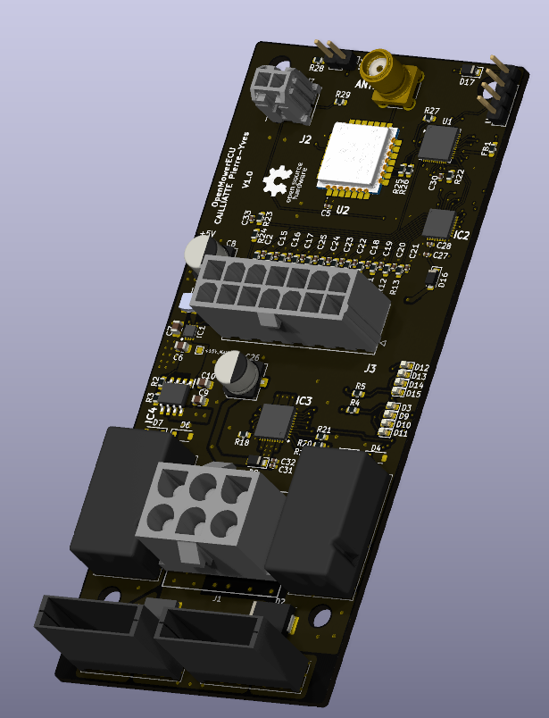

# MowerBoard

<p align="center">
  
  
  
  
  
</p>

---

**MowerBoard** est une unité de contrôle électronique (ECU) alternative, robuste et 100% open-source pour tracteurs tondeuses autoportées thermiques.

L'objectif principal de ce projet est de fournir une solution logicielle et matérielle entièrement libre. En mettant à disposition l'intégralité des schémas de conception, des fichiers de fabrication et du code source, nous démocratisons l'accès à une technologie généralement propriétaire et verrouillée par les fabricants.

---

<p align="center">
  
</p>

---

## ⚡ À Propos de ce Projet

> **⚠️ Important :** Je suis un **maker amateur passionné par l'électronique**, pas un professionnel de l'ingénierie ni de la motoculture. 
> 
> Ce projet est développé **sur mon temps libre** et représente mon apprentissage et mes expériences personnelles. **Il peut contenir des erreurs de conception, des mauvaises pratiques ou des défauts** que je ne pourrais pas identifier seul.
>
> Je partage ce travail dans un esprit collaboratif et éducatif. Si tu utilises ce projet, sois conscient que :
> - La conception peut ne pas être optimale
> - Il n'y a pas de validation professionnelle ou de certification
> - Des améliorations et corrections peuvent être nécessaires
> - **Toute erreur reste ta responsabilité personnelle**
> - Le support n'est disponible que sur la base du temps libre disponible
>
> **Je t'encourage vivement à faire review ta réalisation par un professionnel** avant une utilisation critique.

---

## 📋 Table des matières

- [À Propos de ce Projet](#-à-propos-de-ce-projet)
- [Machine Cible](#-machine-cible)
- [État du projet](#-état-du-projet)
- [Caractéristiques principales](#-caractéristiques-principales)
- [Spécifications techniques](#-spécifications-techniques)
- [Télémétrie & Home Assistant](#-télémétrie--home-assistant)
- [Coût estimé](#-coût-estimé)
- [Installation & Démarrage](#-installation--démarrage)
- [Structure du projet](#-structure-du-projet)
- [Clause de non-responsabilité](#-clause-de-non-responsabilité--risques-critiques)
- [Licence](#-licence)
- [Contributions](#-contributions--état-du-projet)

---

## 🎯 Machine Cible

**MowerBoard** a été conçu et développé pour : **STAUB BLIZZARD 107 L 16 KH (2019)**

- **Moteur :** EMAK K1600 AVD (16 ch, 452 cm³)
- **Année :** 2019
- **Tension système :** 12V batterie

Cette ECU remplace le contrôleur d'origine de ce tracteur de pelouse, offrant une solution open-source robuste et facilement hackable.

### Portabilité & Forks

Bien que spécifiquement adapté au STAUB BLIZZARD 107 L, le design modulaire permet des adaptations pour d'autres tracteurs de pelouse avec architecture similaire.

Si tu adaptes pour un autre modèle, crée un fork et documente tes changements ! 🍴

---

## 🚦 État du projet

| Aspect | Statut |
|--------|--------|
| **Statut global** | 🛠️ Développement en cours |
| **Phase actuelle** | 🧪 Version alpha |
| **Hardware** | ✅ Saisie terminée (KiCad 10) |
| **Firmware** | 🔄 Écriture initiale en cours (C brut, microcontrôleur AVR) |
| **Structure du dépôt** | 🔄 Organisation en cours |
| **Documentation** | 🔄 En cours |
| **Release stable** | ⏳ Non disponible |

---

## 🚀 Caractéristiques principales

*   **✨ Matériel et Code 100% Libres :** Accès total aux schémas électroniques, fichiers de routage (PCB) et code source du firmware sans restriction d'accès. Inspiré par la philosophie du mouvement open-source.

*   **🛡️ Architecture Robuste :** Conçu spécifiquement pour l'environnement difficile d'un véhicule thermique (vibrations, parasites électromagnétiques induits par l'allumage, variations de tension de batterie, humidité).

*   **🔒 Logique de Sécurité Centralisée :** Gestion stricte et déterministe des boucles de sécurité critiques :
    - Détection de présence siège
    - Engagement/désengagement des lames
    - Position du point mort
    - Frein de parking
    - Arrêt d'urgence matériel
    - **Failsafe matérielle** : DO_EN en pulldown → coupage automatique des sorties en cas de watchdog

*   **⚡ Contrôle de Puissance Intégré :** Commande directe des actionneurs avec protections adaptées :
    - Embrayage électromagnétique de lame
    - Solénoïde de démarreur
    - Gestion thermique et overcurrent

*   **📊 Diagnostic & Télémétrie LoRa :** Support des interfaces de communication pour logging et diagnostic :
    - Communication série UART
    - **Télémétrie longue portée via LoRa** (Wio-E5-LE de Seeed en modem)
    - Monitoring à distance et diagnostics temps-réel (non-critique pour la sécurité)
    - **Intégration Home Assistant** pour domotique locale

*   **💰 Solution Économique :** Coût matériel estimé **~100€** pour fabriquer une carte (bien inférieur aux solutions propriétaires commerciales)

---

## 🛠 Spécifications Techniques

Le projet est divisé en deux domaines totalement ouverts :

### Architecture

*   **Cœur temps-réel :** AVR128DB (boucles de sécurité déterministes, contrôle des actionneurs)
*   **Modem LoRa :** Wio-E5-LE de Seeed (télémétrie optionnelle, non-critique)
*   **Failsafe matérielle :** DO_EN en pulldown garantit l'arrêt en cas de défaillance du MCU

### Hardware (Matériel)

*   **Outil de conception :** KiCad 10
*   **Fichiers fournis :**
    - Schémas de principe détaillés
    - Routage de puissance et signaux
    - Nomenclature complète (BOM)
    - Fichiers Gerber (prêts pour fabrication PCB)
*   **Microcontrôleur principal :** AVR128DB
*   **Module LoRa :** Wio-E5-LE de Seeed (STM32WLE5xx)
*   **Tensions supportées :** 12V batterie, régulation embarquée

### Firmware (Code)

*   **Langage :** C brut (pas de couche d'abstraction matérielle)
*   **Compilateur :** MPLAB X / XC Compiler
*   **Caractéristiques :**
    - Boucles de sécurité déterministes temps-réel
    - Gestion des modes de veille (économie d'énergie)
    - Communication séries (UART)
    - Watchdog matériel et software
    - Failsafe électronique : perte de contrôle → arrêt automatique

### Module LoRa (Télémétrie)

*   **Module :** Seeed Wio-E5-LE (fonctionne en modem indépendant)
*   **Protocole :** LoRaWAN / LoRa
*   **Fonction :** Transmission longue portée des données de diagnostic et de télémétrie
*   **Avantages :** 
    - Portée jusqu'à plusieurs kilomètres
    - Faible consommation énergétique
    - Non-critique pour la sécurité (arrêt indépendant du LoRa)

---

## 📱 Télémétrie & Home Assistant

Le module LoRa transmet les données de la tondeuse vers une gateway LoRaWAN locale, intégrée dans **Home Assistant**.

### Données remontées

**Phase 1 (MVP) :**
- **Horamètre** : Cumul des heures de fonctionnement
- **Tension batterie** : État de charge et diagnostic

**Phase 2 (futur) :**
- Température moteur
- Cycle des lames
- Diagnostics avancés

### Architecture

```
ECU (Wio-E5-LE) 
    ↓ LoRa
Gateway LoRaWAN Seeed
    ↓ Ethernet/WiFi
Home Assistant (local)
    ↓
Dashboard / Alertes / Automations
```

### Utilité

- **Monitoring à distance** : Suivi de l'état depuis le canapé
- **Historique** : Logs des heures de tonte
- **Alertes** : Notification si batterie faible, etc.
- **Automations** : Intégration avec d'autres services domotiques

> **Note :** La télémétrie est **optionnelle et non-critique**. La tondeuse fonctionne normalement même si le LoRa est déconnecté.

---

## 💰 Coût estimé

**Coût de fabrication prévu : ~100€** (pour une carte complète, pièce unique)

Cette estimation inclut :
- PCB (fabrication industrielle)
- Composants électroniques (résistances, condensateurs, ICs)
- Module LoRa Wio-E5-LE
- Connecteurs et éléments passifs
- Régulateur 12V et protections

**Cette solution est significativement moins coûteuse que les ECU propriétaires du marché**, tout en offrant des capacités équivalentes ou supérieures.

> **Note :** Le coût peut varier selon les fournisseurs, les quantités commandées et les taux de change. Cette estimation est basée sur les prix courants des composants (2024). En production de volume, le coût pourrait être réduit.

---

## 🚀 Installation & Démarrage

### Prérequis

**Pour le Hardware :**
- KiCad 10.0+
- Outils de fabrication PCB (si fabrique soi-même)
- Composants électroniques (voir BOM)

**Pour le Firmware :**
- MPLAB X IDE
- Compiler XC8 (Microchip)
- Programmateur AVR (ex : PICKIT5)

**Pour la Télémétrie (optionnel) :**
- Home Assistant (installation locale)
- Gateway LoRaWAN Seeed (WM1302, etc.)

### Étapes de mise en place

#### 1. Cloner le dépôt
```bash
git clone https://github.com/pcailliatte/MowerBoard.git
cd MowerBoard
```

#### 2. Hardware - Fabriquer la carte
- Ouvrir les fichiers KiCad dans `Hardware/`
- Exporter les fichiers Gerber
- Envoyer à un fabricant PCB (ex : JLCPCB, PCBway)
- Souder les composants (voir BOM pour la liste complète)

#### 3. Firmware - Compiler et flasher
```bash
cd Firmware/
mplab build
# Programmer via AVR ISP
```

#### 4. Télémétrie (optionnel)
- Configurer la gateway LoRaWAN dans Home Assistant
- Flasher le firmware LoRa sur le Wio-E5-LE
- Ajouter les sensors dans Home Assistant

---

## 📁 Structure du projet

⚠️ **La structure du dépôt est actuellement en cours d'organisation. Les chemins et répertoires ci-dessous reflètent la vision finale du projet.**

```
MowerBoard/
├── Hardware/
│   ├── STAUB_BLIZZARD_107L/
│   │   ├── Schematics/      # Schémas électroniques KiCad
│   │   ├── PCB/             # Fichiers de routage et Gerber
│   │   ├── BOM.csv          # Nomenclature des composants
│   │   └── Doc/             # Documentation hardware spécifique
│   └── Generic/             # Composants réutilisables pour autres modèles
├── Firmware/
│   ├── src/                 # Code source C
│   ├── include/             # En-têtes
│   ├── Makefile             # Build configuration
│   └── Doc/                 # Documentation firmware
├── LoRa/
│   ├── src/                 # Code LoRa / Wio-E5-LE
│   ├── telemetry/           # Schéma de télémétrie
│   └── Doc/                 # Documentation LoRa & Home Assistant
├── Doc/
│   ├── assets/              # Images et ressources
│   ├── DESIGN.md            # Rationale de conception
│   ├── ASSEMBLY.md          # Guide d'assemblage
│   ├── SAFETY.md            # Guides de sécurité
│   └── COMPATIBILITY.md     # Compatibilité avec autres modèles
├── README.md                # Ce fichier
├── CONTRIBUTING.md          # Guide de contribution
└── LICENCE.MD               # Texte complet de la licence

```

---

## ⚠️ Clause de Non-Responsabilité & Risques Critiques

### 🚨 DANGER DE MORT ET DE BLESSURES GRAVES

Un tracteur tondeuse est une machine lourde dotée d'un plateau de coupe rotatif à haute vitesse. **Vos actions de conception, de soudure, de câblage, de programmation et d'intégration de cette carte vous engagent personnellement.**

#### Responsabilité absolue de vos actions

*   L'intégration de cette carte, la modification du faisceau électrique d'origine, le flashage du firmware et le **shunt volontaire ou involontaire** des boucles de sécurité construites **relèvent de votre seule responsabilité légale et pénale.**
*   Une défaillance de cette ECU peut entraîner :
    - La perte de contrôle du moteur
    - L'engagement involontaire des lames de coupe
    - La perte du freinage d'urgence
    - **Des blessures graves ou mortelles**

#### Absence de Garantie

Ce projet est fourni **"en l'état"**, à des fins éducatives et de recherche, **sans aucune garantie d'aucune sorte**, expresse ou implicite, quant à sa sécurité, sa fiabilité, sa conformité légale ou son fonctionnement.

#### Limitation de Responsabilité

En aucun cas les auteurs, contributeurs ou titulaires du copyright ne pourront être tenus responsables des dommages directs, indirects, accessoires ou consécutifs (incluant mais non limités aux blessures, décès, dommages matériels) résultant de l'utilisation ou de l'abus de ce projet.

#### Statut du Projet & Expertise

**Je suis un maker amateur passionné par l'électronique**, développant ce projet **sur mon temps libre**, pas un professionnel de l'ingénierie ni de l'industrie agro-mécanique. **Ce projet peut contenir des erreurs de conception, des défauts, ou des mauvaises pratiques** que je n'aurais pas identifiés seul.

**Je te recommande vivement de faire valider ta réalisation par un professionnel qualifié** avant toute utilisation sur une machine réelle.

#### Conformité légale & Assurance

Avant toute intégration :
- ✅ Consultez un ingénieur agréé
- ✅ Vérifiez la conformité réglementaire locale
- ✅ Contactez votre assurance
- ✅ Faites review votre travail par un professionnel
- ✅ Testez exhaustivement dans un environnement isolé et sécurisé

---

## 📜 Licence

Ce projet est publié sous licence **CERN Open Hardware Licence - Strong Reciprocal v2 (CERN-OHL-S v2)**.

### Ce que cela signifie

*   **Partage et Fork :** Vous êtes libre de copier, modifier et distribuer ce projet (schémas, PCB, code).

*   **Attribution :** Vous devez conserver la mention du copyright d'origine et l'attribution au projet MowerBoard dans tous les travaux dérivés.

*   **Usage Commercial :** La fabrication et la vente commerciale de cette carte **sont autorisées**, à condition de respecter les clauses ci-dessous.

*   **Copyleft Fort (Pas de prise de contrôle) :** Si vous modifiez le matériel, les schémas ou le code et que vous les distribuez, **vous avez l'obligation légale de publier l'intégralité de vos modifications** sous la même licence CERN-OHL-S v2.

*   **Aucun droit de marque :** Vous ne pouvez pas utiliser le nom "MowerBoard" pour des produits dérivés sans permission explicite.

**Le texte complet de la licence est disponible dans le fichier `LICENCE.MD`.**

---

## 👥 Contributions

Ce dépôt centralise l'ingénierie partagée du projet. Les schémas, nomenclatures (BOM) et codes sources sont documentés ouvertement au fur et à mesure du développement.

### Comment contribuer ?

1. **Fork le projet** sur GitHub
2. **Créer une branche** (`git checkout -b feature/ma-contribution`)
3. **Soumettre une Pull Request** avec une description claire
4. **Attendre la review** des contributeurs

### Directives de contribution

*   Respectez la structure existante du projet
*   Testez votre code avant de le soumettre
*   Documentez vos changements
*   Utilisez des messages de commit clairs en français ou anglais
*   Respectez la licence CERN-OHL-S v2

### Signalement de bugs

Utilisez l'onglet Issues pour signaler des bugs ou suggérer des améliorations.

**Consultez le fichier `CONTRIBUTING.md` pour des directives détaillées.**

---

## 📚 Documentation supplémentaire

- [Guide de contribution](CONTRIBUTING.md)
- [Guide d'assemblage](Doc/ASSEMBLY.md)
- [Design & Architecture](Doc/DESIGN.md)
- [Guide de sécurité](Doc/SAFETY.md)
- [Compatibilité & Portabilité](Doc/COMPATIBILITY.md)
- [FAQ & Troubleshooting](Doc/FAQ.md)

---

## 🔗 Ressources externes

*   [KiCad Documentation](https://docs.kicad.org/)
*   [CERN Open Hardware Licence](https://ohwr.org/cern_ohl_v2_how_to_use.pdf)
*   [Microchip AVR Documentation](https://www.microchip.com/)
*   [Seeed Wio-E5-LE Documentation](https://wiki.seeedstudio.com/Wio_E5_series_LoRa_Module/)
*   [Home Assistant Documentation](https://www.home-assistant.io/)
*   [Seeed LoRaWAN Gateway](https://wiki.seeedstudio.com/Gateway_LoRaWAN/)

---

## ✉️ Contact & Support

*   **Issues GitHub :** Pour les bugs et questions techniques
*   **Discussions GitHub :** Pour les échanges communautaires

---

**Dernière mise à jour :** Juillet 2026
**Maintaineur :** [@pcailliatte](https://github.com/pcailliatte) (maker amateur passionné développant sur temps libre)
